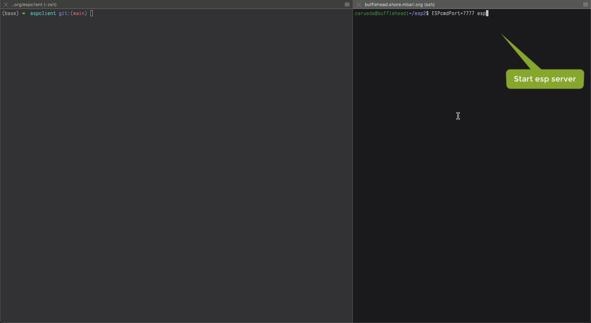

# ESP Client in Rust

What: A basic ESP client implementation in Rust.

Why: Learn and practice some basic Rust socket programming.

How: Using standard Rust libraries for socket connection and some others.
Use of more sophisticated libraries (tokio, async-std, etc.) are interesting
possible variations but not the focus of this exercise, at least initially.
Feel free to contribute if you are so inclined!

## Installing

With `cargo` on your system, you can install `espclient` as follows:

```
$ cargo install --git https://github.com/mbari-org/espclient.git
```

Of course, you can also clone this repo and then run tests, run the program, build, etc.:

```
$ cargo test
   Compiling espclient v...
    Finished test [unoptimized + debuginfo] target(s) in 0.97s
     Running target/debug/deps/espclient-134c8ea5e5ff6ed0

running 2 tests
test encoder::tests::encode_line_tests ... ok
test decoder::tests::unfinished_line ... ok

test result: ok. 2 passed; 0 failed; 0 ignored; 0 measured; 0 filtered out; finished in 0.00s
```

Other typical commands I run here (see [justfile](justfile)):

    just test
    just clippy
    just release
    just install

## Running

Have an ESP server running somewhere and then launch the program indicating
the corresponding `host:port`, for example: 
`espclient bufflehead.shore.mbari.org:7777` (see below).

Program usage:

```
$ espclient --help
espclient 0.0.3
ESP Client in Rust

USAGE:
    espclient [FLAGS] [OPTIONS] <server>

FLAGS:
    -d, --debug      Summarize raw socket traffic on STDERR
    -h, --help       Prints help information
    -s, --simple     Simple output (by default, show stream multiplexing explicitly)
    -V, --version    Prints version information

OPTIONS:
    -c, --cmd <cmd>      Command beginning interactive session [default: showlog 0]
    -n, --name <name>    My name as client for ESP server's log [default: espclient.rs]

ARGS:
    <server>    host:port indicating the running ESP server
```

---

This screencast shows a quick a session with an ESP server running on bufflehead:



## Change log

- 2022-01-27: minor general updates
- 2022-01-05: enable ci; fix clippy error
- 2021-04-20: enable colored CLI
- 2020-08-19: various adjustments incl improved/simplified prompt handling.
- 2020-08-18: initial functional version

## Some refs

- https://blog.burntsushi.net/rust-error-handling/#the-error-trait
- https://github.com/jtenner/telnet_codec 
- https://stjepang.github.io/2020/04/03/why-im-building-a-new-async-runtime.html
  ... broken link now. See https://news.ycombinator.com/item?id=25521669
